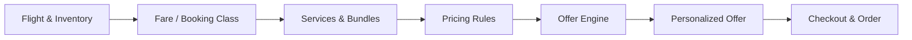

<div align="center">

# ✈️ WingMate

### Dynamic Airline Offer & Pricing Engine

**Revenue Management · Inventory-Aware Pricing · Dynamic Bundling · Personalized Offers**


</div>

<p align="center">
  
</p>

WingMate explores how a traditional airline booking flow can evolve into a more dynamic offer experience. Instead of treating fares, inventory, services and passenger context as separate pieces, the platform combines them through an offer engine that can generate more relevant and commercially meaningful offers.

> Built collaboratively as an internship project around **airline revenue management, dynamic pricing, business analysis and offer management**.

---

## ✨ At a Glance

| | Capability | What it does |
|---|---|---|
| 🎯 | **Dynamic Pricing** | Applies route, trip, loyalty, travel-history and departure-day rules to offers |
| 🧳 | **Bundles & Ancillaries** | Builds configurable packages from baggage, seats, lounge, Wi-Fi, meals and more |
| 🪑 | **Inventory-Aware Offers** | Connects booking classes, base fares and seat availability before checkout |
| 🧠 | **Wingo Recommendations** | Matches passenger needs with valid bundle options using the same pricing logic |
| 🔒 | **Safe Checkout** | Validates expiring offers, locks inventory and prevents overselling |
| ⚙️ | **Admin Control** | Manages flights, fares, services, constraints, pricing rules, inventory and orders |

---

## 🧭 How the Offer Engine Works



The core idea is simple: **an offer is the result of multiple business decisions working together**, not just a static fare lookup.

---

## 💸 Pricing Logic

Pricing rules are evaluated by priority and can react to different parts of the offer context.

```text
route == "IST-LHR"
trip_type == "round_trip"
route_count_12m >= 10
loyalty_tier == "elite"
departure_day == "fri"
```

Rules can then apply actions such as:

- percentage discounts or surcharges
- fixed discounts
- fixed fares
- service inclusion

This allows the system to model scenarios such as **weekend uplifts, route-based pricing, repeat-route incentives, loyalty benefits and round-trip discounts**.

---

## 🧩 Flexible Services & Constraints

Services are treated as reusable building blocks rather than hard-coded package fields. A bundle can include combinations of baggage, seat selection, change/refund rights, lounge access, priority boarding, Wi-Fi, meals and other services.

To keep custom offers valid, WingMate supports relationships such as:

- `requires` — one service depends on another
- `conflicts` — two services cannot be selected together
- `min_quantity`
- `max_quantity`

---

## 🪽 Wingo Custom Bundle Builder


Wingo lets passengers describe what they actually need — for example baggage, seat selection, change rights or lounge access — and recommends valid packages using the same pricing rules and constraints as the main offer engine.

This turns bundle selection from a static package comparison into a more personalized decision experience.

<br clear="right"/>

---

## 🛠️ Tech Stack

| Layer | Technologies |
|---|---|
| **Backend** | Laravel 13, PHP 8.3+, Filament 5, Laravel Fortify, Reverb |
| **Frontend** | React 19, TypeScript, Inertia.js, Tailwind CSS 4, Vite |
| **Quality** | Pest, Larastan / PHPStan, ESLint, Prettier |

---

## 📌 Project Context

WingMate was developed collaboratively during an internship project focused on **airline revenue management, dynamic pricing, bundling and offer management**.

The work combined business and technical perspectives: understanding airline pricing and inventory scenarios, translating them into requirements and business rules, and turning those rules into a working product experience.

The project is therefore not only a booking interface. Its main focus is the **decision layer behind an airline offer** — how inventory, passenger context, ancillary services, bundle design and pricing rules can work together before a customer reaches checkout.

---

## 👥 Contributors

- [@yigitkerem](https://github.com/yigitkerem) — repository owner and project contributor
- [@fazgerr](https://github.com/fazgerr) — business analysis, pricing/revenue-management scenarios, requirements, product logic and project documentation

> Contributions across the project include product thinking, business analysis, airline pricing logic, software implementation, testing and documentation.

---

## 🚀 Run Locally

<details>
<summary><strong>Show setup steps</strong></summary>

```bash
git clone https://github.com/yigitkerem/WingMate.git
cd WingMate
composer setup
composer dev
```

If `.env` is not created automatically, copy `.env.example` to `.env` and configure the required database and service values.

</details>

---

## 📚 Documentation

For the detailed admin setup, pricing rules, service constraints, public search, checkout, imports and troubleshooting flow, see [`USER_GUIDE.md`](./USER_GUIDE.md).
